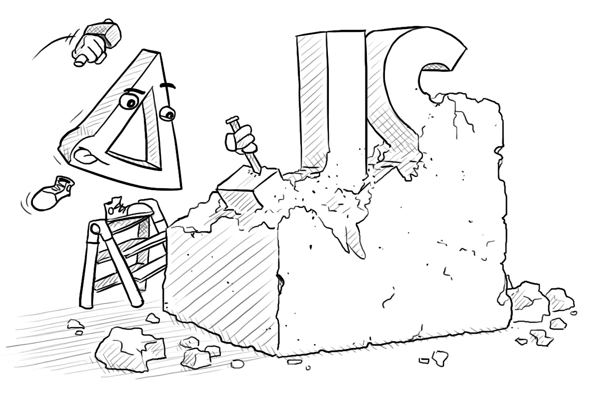
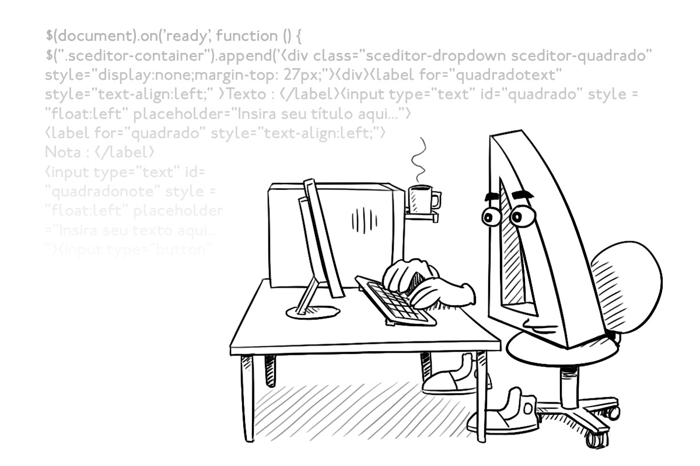
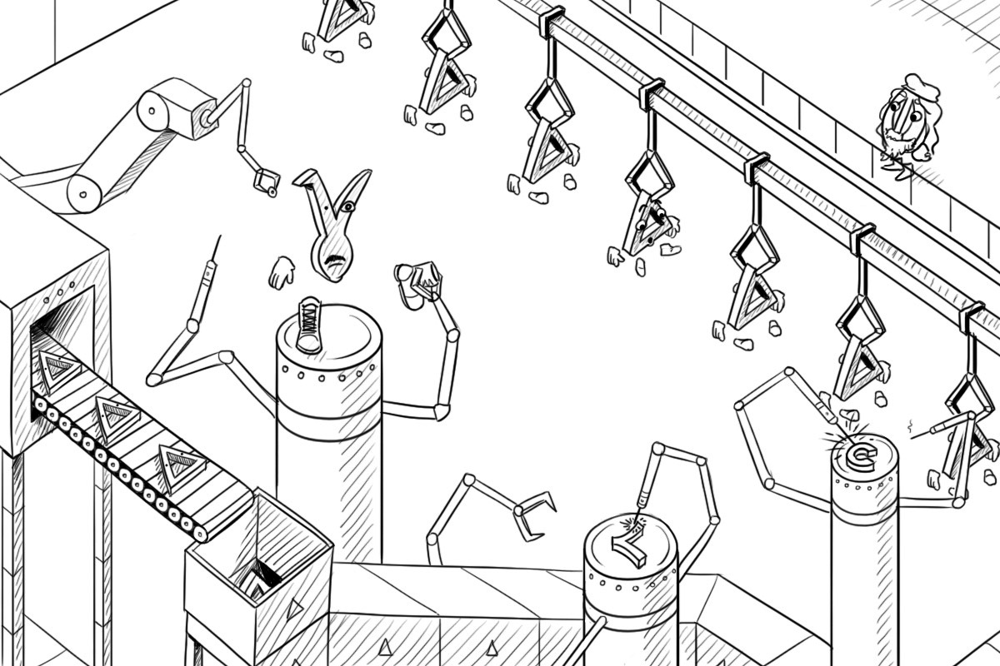

# delta.js

achieve modularity and separation of concerns through feature-oriented programming

## Description



Programming is an activity very prone to human error, especially if you have
multiple developers changing the same code-base at the same time.
As more and more features are implemented by different programmers, progress will
often slow to a crawl. Programmers can easily lose overview and step on each others
toes when their code is spread across the code base surrounded by
the code of others.

*delta.js* helps you organize your JavaScript code in terms of *features*.
As it turns out, files, modules, objects, functions (and so on), are not
the right abstractions for describing a feature. But they are very good at
other stuff! This library introduces the notion of a *delta*, which complements
those other constructs.

A delta is the place to gather all the code belonging to a specific feature.
Basically, for each piece of code, you instruct the delta to put that code in
the file, module, object or function where it belongs. That way, the code
can *physically* be gathered in one place, and therefore be easy to maintain.

This has other benefits as well. By having some deltas be explicitly applied
*after* others, you give them permission to overwrite things.
If two deltas that are *unordered* try to overwrite each others code,
you will get a friendly error message. Moreover, by separating your features
so explicitly, you will be able to turn them on or off with a switch, for
either debugging or production.

This might all seem overly complicated at first. But once you get started,
you'll soon fall in love with this approach.

At this time, delta.js is a runtime library. But in concept, deltas could be
applied by a preprocessor. This will be supported by a future version.


## Installation


This library depends only on
[js-graph](https://github.com/mhelvens/js-graph).


### Install using Bower

`delta.js` is available as a [Bower](http://bower.io/) package:

```shell
bower install delta.js
```

### Install using NPM

`delta.js` is available as an [NPM](https://www.npmjs.org) package:

```shell
npm install delta.js
```

## Importing `DeltaJs`

The delta.js package offers a [UMD](https://github.com/umdjs/umd) API, so it supports
AMD ([RequireJS](http://requirejs.org/)), CommonJS and script-tags:

```javascript
requirejs(['lib/delta.js/dist/delta.js'], function (DeltaJs) {
    // use DeltaJs
}
```

```javascript
var DeltaJs = require('lib/delta.js/dist/delta.js')
// use DeltaJs
```

```html
<script src="lib/delta.js/dist/delta.js"></script>
<!-- use DeltaJs -->
```

## Using `DeltaJs`


`DeltaJs` is a class that can be instantiated:

```javascript
var deltaJs = new DeltaJs();
```

`deltaJs` is a context within which all new types of delta operation and all project-specific
features are localized. It is also home to a core *delta model*, which is the structure that
organizes and orders a set of deltas.
Using multiple `DeltaJs` instances allows you to use different sets of deltas and rules in
the same project that work independently from each other. But you'll usually need only one.


## The `DeltaJs` API



Given a `DeltaJs` instance, the following methods are available:

### `.vp(name, initialValue)`

This method creates a *variation point*. It should be used in your code-base wherever
deltas may need to make changes. Each variation point needs a unique name for
deltas to refer to. The method modifies a value 'in place', and does not make
a copy. For example:

```javascript
function MyClass() {
    this.someMethod = function () {};
    this.someField  = 'some value';
};
deltaJs.vp('MyClass', MyClass);
```

This allows the selected deltas to modify the `MyClass` class, as well as all of its
properties. The `.vp` method also returns the new value. So the following is equivalent
to the example above:

```javascript
var MyClass = deltaJs.vp('MyClass', function MyClass() {
    this.someMethod = function () {};
    this.someField  = 'some value';
});
```


### `.do(name, [options])`

This function returns a `Proxy` interface that may be used to easily create
new deltas / operations in a core delta model that can then target specific
variation points:

```javascript
var proxy = deltaJs.do('cool-feature', {
    // options
});
```

This `proxy` variable can then be used to specify the modifications its
corresponding delta should perform, and where to perform them. For example:

```javascript
proxy.add('MyClass.prototype.coolMethod', function () {
	// do something cool
}).insert('MyClass.prototype.construct', function () {
	this.coolMethod();
});
```

So when the `'cool-feature'` is selected, this delta adds the new `coolMethod` method
to `MyClass`, and ensures that it is called by the existing `construct` method.
A comprehensive list of these operations and how to use them follows later in this document.

Like variation points, deltas in a delta model need a unique name. But deltas and variation
points have separate namespaces. In other words: you may give a delta and a variation
point the same name. (Thought if you find yourself doing this often, you may not have
fully understood the point of delta.js.)

* **Note**: For the sake of simplicity, you may assume that deltas and features are the same thing.
More advanced users may have reasons to see them as separate entities by providing
the option `feature: false`, but because this option defaults to `true`, the code
above defines both a feature and a delta with the name `'cool-feature'`, and links
them one-to-one. For basic usage, you don't need to be aware of this, and may treat
features and deltas as interchangeable concepts.*


#### Predicates

Before listing the supported options, let's briefly describe the notion of 'predicate',
a type of data accepted by several of those options.
A predicate is a condition on the set of selected features, and can be
given as one of the following:

* the value `true`
* the value `false`
* an array of feature-names, interpreted as a conjunction. The condition is true exactly if *all* features in the list are selected.


#### Supported Options

The following options may be passed:

| options              | default   | meaning
| -------------------- | --------- | -------
| `feature`            | `true`    | a Boolean, specifying whether a feature with the same name should be linked to this delta
| `if`                 | `false`   | a predicate, specifying when (if ever) this delta should be automatically selected
| `onlyIf`             | `true`    | a predicate that is required to hold if this delta is ever selected. If this delta is ever selected without this predicate being met, an error will be thrown whenever this delta is applied.
| `after`              | `[]`      | a list of delta names. This delta is guaranteed to be applied after the deltas in the list. If the registration of this delta creates an application order *cycle*, an error will be thrown.
| `selects`            | `[]`      | a list of delta names. If this delta is selected, all deltas in this list will also be selected.

For convenience, there are some options that combine multiple of the above:

| options     | combines
| ----------- | --------
| `iff`       | `if` and `onlyIf`
| `requires`  | `after` and `selects`
| `resolves`  | `if`, `onlyIf` and `after`; and sets `feature` to `false`

Deltas representing specific changes to the variation points can be created through
various operations through the `Proxy` API described below.


### `.select(...deltaNames)`

This method can be used to manually select specific features by name.

```javascript
deltaJs.select('cool-feature', 'silly-feature', 'debugging-patch-359');
```

Other features and deltas, if they are linked with the features given,
can be automatically pulled in through any `if` or `selects` options.

Note that a feature needs to be registered before it can be selected. And a delta needs to be
selected before the appearance of any variation point to which it applies. It is probably
something you want to do very early in your application.


## The `Proxy` API


Deltas can modify values in any number of ways, from completely
replacing them with other values, to making fine-grained modifications in a deeply nested
object. It does so through well-defined *operations*, which you can specify through the
various methods of a `Proxy` instance.

Every delta *targets* a specific JavaScript object, which we'll denote as `target` in the
descriptions below. All operations of that delta act on one of the properties of `target`.
The deltas constructed directly from the delta model target an imaginary root object that
contains all variation points as properties. We'll denote this object as `root`.


### `.modify(key)`

This method returns another `Proxy` object that targets `target[key]`,
allowing us to *step into* a sub-object to make fine-grained modifications
inside:

```javascript
var d1 = deltaJs.do('my-delta');         // d1 targets 'root'
var d2 = d1.modify('vp1');               // d2 targets 'root.vp1'
var d3 = d2.modify('foo').modify('bar'); // d3 targets 'root.vp1.foo.bar'
```

For convenience, the `key` can also be given as a dot-separated list:

```javascript
var d4 = d1.modify('vp1.foo.bar');       // d4 also targets 'root.vp1.foo.bar'
```

The `key` is then usually referred to as a *path*.
This also works for the all the other operations below. It implicitly
constructs a `.modify` chain to reach the right-most key.

* **Note**: because of this shorthand notation, property names that actually
contain the `.` character are not supported (at least for now).*

When you've targeted the proper object, you can use the operations described
below to make specific changes to its properties.


### `.add(key, newValue)`

This makes the delta *add* a new property `key` to `target`, such that `target[key] === newValue`.
Before the operation, it is expected that `typeof target[key] === 'undefined'`. In other words,
it cannot already have a property named `key`.

```javascript
delta.modify('my-vp.foo').add('bar', 'bas');
var value = vp('my-vp', { foo: {}, bar: [] });
expect(value).toEqual({ foo: { bar: 'bas' }, bar: [] });
```


### `.remove(key)`

This makes the delta *remove* the property named `key` from `target`, such that `typeof target[key] === 'undefined'`.
Before the operation, it is expected that `typeof target[key] !== 'undefined'`. In other words, it
must first *have* a property named `key`.

```javascript
delta.modify('my-vp').remove('foo');
var value = vp('my-vp', { foo: { bar: 'bas' }, bar: [] });
expect(value).toEqual({ bar: [] });
```


### `.replace(key, newValue)`

This makes the delta *replace* the property named `key` in `target`, such that `target[key] === value`.
Before the operation, it is expected that `typeof target[key] !== 'undefined'`. In other words, it
must already *have* a property named `key`.

```javascript
delta.modify('my-vp').replace('foo', 'bar');
var value = vp('my-vp', { foo: { bar: 'bas' }, bar: [] });
expect(value).toEqual({ foo: 'bar', bar: [] });
```


### `.prepend(key, newValue)`
### `.append(key, newValue)`
### `.insert(key, newValue)`

These methods work if `target[key]` is an *array* or a *function*,
and respectively prepend, append or insert `newValue` into it.

If `target[key]` is a function, `newValue` also needs to be a function,
which will then be set up to run in the position where it is placed,
and provided with the same arguments and `this` context of the original
function-call.

The `.prepend` operation places the value in the beginning,
and `.append` places it at the end of the existing array / function.

The `.insert` operation is special, because it gives the delta the
freedom to put the value in an arbitrary position; you don't have
any control over the placement.
The advantage of `.insert` is that the order between multiple
insertions does not matter. As far as delta.js is concerned,
`d.insert('f', fn1).insert('f', fn2)` and `d.insert('f', fn2).insert('f', fn1)`
are equivalent. Moreover, two unordered deltas can insert things into the same
array or function without this being regarded as a conflict.

For example, for an array:

```javascript
delta.modify('my-vp').append('a', 999).prepend('a', -999);
var value = vp('my-vp', {
    a: [1, 2, 3]
});
expect(value).toEqual({
	a: [-999, 1, 2, 3, 999]
});
```

And for a function:

```javascript
delta.modify('my-vp').append('f', function (a, b) {
    doOtherThings(a, b);
});
var value = vp('my-vp', {
    f: function (a, b, c) {
        doThings(b, c);
    }
});
```
The variable `value` will be equivalent to:
```javascript
{
    f: function () {
        (function (a, b, c) {
            doThings(a, b);
        }).apply(this, arguments);
        (function (a, b) {
            doOtherThings(a, b);
        }).apply(this, arguments);
    }
}
```

delta.js cannot actually add statements to existing functions. Instead,
it defines a new function, which calls the original and the added function
in the proper order, properly passing the function arguments and `this`
context to both. This has some consequences:

* Local variables are not shared across function 'parts'. 'Function-part local' is also 'delta local'.
* All non-standard properties of a function are lost after a `.prepend`, `.append` or `.insert`.
  If this is undesirable, it is recommended that the original function is written to call
  an auxiliary function, so the delta operations can apply to the auxiliary. For class
  constructors, it is recommended that you use a function `Class.prototype.construct` for
  this purpose:

```javascript
function MyClass() { this.construct.apply(this, arguments) }
MyClass.prototype.construct = function () {};
deltaJs.vp('MyClass', MyClass)
```
```javascript
deltaJs.delta('my-delta').modify('my-vp')
    .append('MyClass.prototype.construct', function (a, b, c) {
        this.doExtraThings(a, b, c);
    });
```


## Future Plans



Here is an incomplete list of future plans for this library:

* useful error messages based on delta model structure
* support for changing HTML and CSS with deltas

<div style="clear: both">&nbsp;</div>

## License

`delta.js` is released under the terms of the [MIT license](http://en.wikipedia.org/wiki/MIT_License).
It permits reuse within both open and proprietary software, provided
all copies of the licensed software include a copy of the MIT License
terms and the copyright notice.
